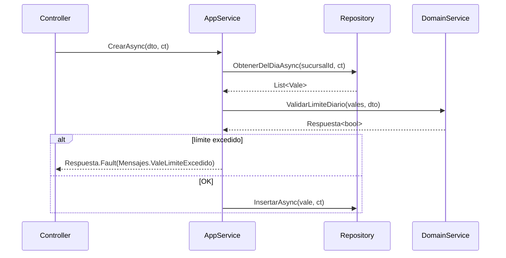

# Protocolo de Diseño (SDD design)

Tu output es el **blueprint que `sdd-apply` ejecuta sin volver a pensar**. Si tu diseño es ambiguo,
apply improvisa; y cuando apply improvisa, aparecen los archivos que nadie decidió crear.

Regla mental: **si apply tiene que tomar una decisión de arquitectura, vos fallaste.**

## 1. Una decisión se documenta con lo que RECHAZASTE

Una decisión sin alternativas rechazadas no es una decisión: es lo primero que se te ocurrió.

```markdown
### Decisión 1: Validación cruzada de vales en Domain Service

**Elegido:** `ValeDomainService.ValidarLimiteDiario(vales, nuevoVale)` — clase estática, sin I/O.
El AppService trae los vales del día y le pasa la colección ya resuelta.

**Rechazado — validar dentro del AppService:** mezcla orquestación (traer datos) con regla de
negocio (el límite). Cuando la regla cambie, hay que tocar un método que además hace I/O y
logging. Viola SRP.

**Rechazado — validar en el Repository con una query de conteo:** más rápido en SQL, pero la
regla de negocio queda escondida en la capa de datos, donde nadie la busca ni la puede testear
sin base. Ganás milisegundos, perdés el dominio.

**Trade-off asumido:** traemos los vales del día a memoria (N chico y acotado por sucursal). Si
N creciera, se revisa — queda anotado como riesgo, no como deuda oculta.
```

Tres partes obligatorias: **qué elegiste**, **qué rechazaste y por qué**, **qué trade-off asumís**.

## 2. Tabla de archivos — el contrato con apply

Toda ruta concreta. Nada de "los archivos del feature X".

| Acción | Archivo | Responsabilidad | Decisión relacionada |
|--------|---------|-----------------|----------------------|
| CREAR | `Application/Features/Vales/ValeDomainService.cs` | validación del límite diario | Decisión 1 |
| MODIFICAR | `Application/Features/Vales/ValeAppService.cs` | invoca el domain service antes de persistir | Decisión 1 |
| CREAR | `Application/Features/Vales/Dtos/CrearValeDto.cs` | request del endpoint | Decisión 2 |
| ELIMINAR | `Application/Features/Vales/ValeValidator.cs` | reemplazado por el domain service | Decisión 1 |

- Todo archivo de la tabla se mapea a **al menos una** decisión. Si no podés mapearlo, no está
  justificado y sobra.
- Si el change toca más de ~8 archivos o estimás >500 líneas, **decilo explícito** en el resumen:
  es uno de los triggers de Judgment Day y el orquestador lo necesita para decidir.

## 3. Diagrama de secuencia — cuándo SÍ y cuándo NO

**SÍ** cuando: hay 3+ participantes, hay flujo condicional que no se entiende leyendo, hay
llamadas async coordinadas, o hay compensación/rollback.

**NO** cuando: es un CRUD lineal. Un diagrama de `Controller → Service → Repository` no le enseña
nada a nadie y es una línea más para mantener desactualizada.

Usá Mermaid, siempre en el artifact:

````markdown

````

## 4. Qué NO hace un diseño

- **NO escribe la implementación.** Firmas de métodos y responsabilidades, sí; cuerpos completos, no.
  Si estás escribiendo el cuerpo, estás haciendo el trabajo de apply con menos contexto que apply.
- **NO redefine los requisitos.** Si el `spec.md` te queda corto o contradictorio, lo anotás en
  `## Assumptions & Open Questions` — no lo "arreglás" por tu cuenta.
- **NO decide cosas fuera del scope del change.** El refactor que descubriste al pasar va como
  observación, no como archivo en la tabla.

## 5. Checklist antes de cerrar el artifact

- [ ] Cada decisión tiene alternativa rechazada CON motivo técnico (no "es peor")
- [ ] Cada archivo de la tabla mapea a una decisión
- [ ] Los escenarios del `spec.md` están todos cubiertos por alguna decisión
- [ ] Las dependencias de capa respetan la dirección hacia adentro
- [ ] Está declarado el impacto estimado (archivos / líneas) para el gate de Judgment Day
- [ ] Las ambigüedades están en `## Assumptions & Open Questions`, no resueltas en silencio
